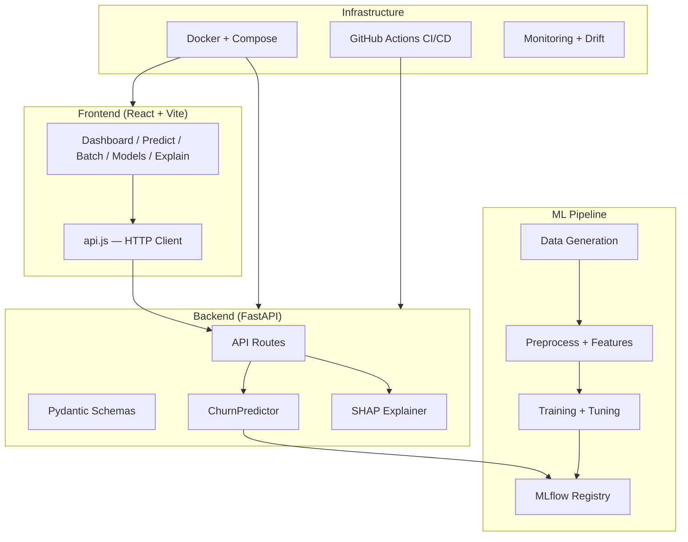

# ChurnOps — System Architecture

> A complete file-by-file breakdown of the project. Every file, what it does, and why it exists.

---

## High-Level Architecture



---

## Root Directory

| File | Purpose | Why It Exists |
|------|---------|---------------|
| `README.md` | Project overview, setup guide, features | First thing anyone sees — orients new developers |
| `pyproject.toml` | Project metadata + tool config (Ruff, MyPy, Pytest, Coverage) | Single source of truth for all Python tooling configuration |
| `requirements.txt` | Full Python dependencies | Used by `pip install` and Docker builds |
| `requirements-api.txt` | Lightweight API-only dependencies | Docker image uses this for a smaller, faster container |
| `Makefile` | CLI shortcuts (`make serve`, `make test`, etc.) | Standardizes commands — no one memorizes long CLI strings |
| `Dockerfile` | Backend container definition | Packages the API for deployment anywhere (cloud, on-prem) |
| `docker-compose.yml` | Multi-service orchestration (API + Frontend) | One command (`docker-compose up`) spins up the entire stack |
| `.gitignore` | Files excluded from version control | Prevents committing data, venvs, caches, and secrets |
| `.pre-commit-config.yaml` | Git hooks for code quality | Runs Ruff linter, formatter, and MyPy before every commit |

---

## `src/` — Core Source Code

The heart of the application. Everything in `src/` is importable as a Python package.

### `src/__init__.py`
Package initializer. Makes `src` importable.

---

### `src/api/` — FastAPI Application

This is the REST API that serves predictions to the frontend and any external client.

| File | What It Does | Why It's Important |
|------|--------------|-------------------|
| `main.py` | Creates the FastAPI app, configures CORS, mounts Prometheus metrics, includes all routers | **Entry point** — `uvicorn src.api.main:app` starts here |
| `schemas.py` | Pydantic models for all request/response types (`CustomerFeatures`, `PredictionResponse`, `BatchUploadResponse`, etc.) | Ensures type safety and auto-generates OpenAPI docs |
| `dependencies.py` | Shared dependency injection (e.g., getting the predictor instance) | Avoids duplicating initialization logic across routes |
| `middleware.py` | Request logging and timing middleware | Tracks API latency for monitoring |

#### `src/api/routes/` — API Endpoints

| File | Endpoints | Purpose |
|------|-----------|---------|
| `predictions.py` | `POST /predict` — Single prediction<br>`POST /predict/batch` — Batch from JSON<br>`POST /predict/upload` — Batch from CSV file<br>`POST /explain` — SHAP explanation | Core business logic — where predictions happen |
| `health.py` | `GET /health` | Kubernetes/Docker liveness probe |
| `model_info.py` | `GET /model/info` | Returns model name, version, metrics, feature count |
| `monitoring.py` | `GET /monitoring/metrics` | Prometheus-compatible metrics for dashboards |

---

### `src/data/` — Data Pipeline

Handles the full journey from raw CSV → clean data → engineered features.

| File | What It Does | Why It's Important |
|------|--------------|-------------------|
| `ingest.py` | Loads raw CSV data from `data/raw/` | First step — gets data into the pipeline |
| `preprocess.py` | Handles missing values, type conversions, outlier removal | Dirty data = bad models. This ensures quality |
| `validate.py` | Schema validation, data quality checks (null rates, value ranges) | Catches problems early before training |
| `features.py` | Domain-specific feature engineering (ratio features, interaction terms, one-hot encoding, scaling) | **This is where the magic happens** — good features = good models |

**Data flow:**
```
Raw CSV → ingest.py → preprocess.py → validate.py → features.py → Feature Parquet
```

---

### `src/models/` — Machine Learning

| File | What It Does | Why It's Important |
|------|--------------|-------------------|
| `train.py` | Trains 6 ML algorithms, logs everything to MLflow | Core training loop with experiment tracking |
| `predict.py` | `ChurnPredictor` class — loads MLflow model, runs inference, computes SHAP | **The production inference engine** — used by every API endpoint |
| `evaluate.py` | Calculates accuracy, precision, recall, F1, AUC, confusion matrix | Measures model quality objectively |
| `hyperparameter_tuning.py` | Optuna-based Bayesian optimization for XGBoost/LightGBM | Squeezes extra performance from models |
| `explain.py` | SHAP integration utilities | Makes predictions interpretable ("why did the model predict churn?") |
| `registry.py` | MLflow model registration (staging → production promotion) | Model versioning — tracks which model is serving traffic |
| `demo_model.py` | Fallback demo model for when MLflow isn't available | Ensures the API never crashes even without a trained model |

---

### `src/monitoring/` — Production Monitoring

| File | What It Does | Why It's Important |
|------|--------------|-------------------|
| `drift_detector.py` | Detects data distribution shifts using statistical tests | Models degrade when input data changes — this catches it |
| `metrics_collector.py` | Prometheus metrics (prediction counts, latencies, error rates) | Enables Grafana dashboards and alerting |
| `performance_tracker.py` | Tracks model accuracy over time | Answers: "Is the model still performing well?" |
| `alerts.py` | Alert rules for drift/performance thresholds | Notifies the team when something goes wrong |

---

### `src/utils/` — Shared Utilities

| File | What It Does | Why It's Important |
|------|--------------|-------------------|
| `config.py` | Loads YAML configs from `configs/`, provides `get_config()` | Single config entrypoint — avoids hardcoded values |
| `helpers.py` | Timer decorator, path utilities | Reduces boilerplate across all modules |
| `logging.py` | Configures Loguru structured logging | Consistent, searchable logs across the entire app |

---

## `configs/` — Configuration Files

All YAML configuration, separated by concern.

| Directory | Files | Purpose |
|-----------|-------|---------|
| `configs/config.yaml` | Main config (MLflow URI, API settings) | App-wide settings |
| `configs/data/` | 8 domain YAMLs (telco.yaml, banking.yaml, etc.) | Each domain's column mappings, target variable, data paths |
| `configs/model/` | 6 model YAMLs (xgboost.yaml, lightgbm.yaml, etc.) | Hyperparameter defaults and search spaces |
| `configs/training/training.yaml` | Training config (test split, random seed, CV folds) | Reproducibility settings |
| `configs/monitoring/drift.yaml` | Drift detection thresholds and feature lists | Which features to monitor and at what thresholds |

**Why YAML?** Configs change more often than code. YAML lets you modify behavior without touching Python files.

---

## `scripts/` — Operational Scripts

These are the scripts you actually run to operate the pipeline.

| File | What It Does | When You Run It |
|------|--------------|-----------------|
| `generate_8_domains.py` | Generates 1M+ realistic customers per domain using NumPy distributions | Once, to create the training dataset |
| `run_training.py` | Trains all 6 models for a domain, logs to MLflow, saves preprocessors | Every time you retrain models |
| `run_tuning.py` | Runs Optuna hyperparameter optimization | When you want to improve model performance |
| `export_model.py` | Bundles the production model from MLflow into `models/production/` | Before deploying the application to production |
| `test_inference.py` | End-to-end inference test with sample data | To verify the full prediction pipeline works |
| `test_pipeline.py` | Tests the data → preprocess → features pipeline | To verify data processing is correct |
| `orchestrate_all.ps1` | PowerShell script to run the full pipeline across all domains | Full automation — runs everything sequentially |

---

## `data/` — Data Directory

| Subdirectory | Contents | Format |
|---|---|---|
| `data/raw/` | 8 CSV files (`telco_churn_massive.csv`, etc.) — ~330MB total | Raw generated data |
| `data/processed/` | 8 Parquet files (`telco_clean.parquet`, etc.) | Cleaned, validated data |
| `data/features/` | 8 Parquet files (`telco_features.parquet`, etc.) | Engineered features ready for training |

**Why Parquet?** 10x smaller than CSV, 100x faster to read, preserves data types.

---

## `models/` — Saved Artifacts

| Subdirectory | Contents | Purpose |
|---|---|---|
| `models/preprocessors/` | 16 joblib files (8 domains × 2: `*_preprocessor.joblib` + `*_engineer.joblib`) | Fitted preprocessing pipelines (scalers, encoders) that must match training |
| `models/production/` | Bundled MLflow model artifacts (e.g., `MLmodel`, `conda.yaml`, binaries) | Enables standalone deployment without a live MLflow tracking server |

**Why save preprocessors?** At inference time, new data must be transformed the exact same way as training data. These files ensure consistency.

---

## `reports/` — Output Artifacts

| File Pattern | Purpose |
|---|---|
| `model_comparison_*.json` | Per-domain comparison of all algorithms (accuracy, F1, AUC, etc.) |
| `confusion_matrix_*.json` | Per-algorithm confusion matrices |

Used by the frontend's **Model Comparison** page to display results.

---

## `frontend/` — React Dashboard

| File | Purpose |
|------|---------|
| `index.html` | HTML entry point + Google Fonts |
| `vite.config.js` | Vite build configuration |
| `package.json` | Node dependencies (React, Recharts, Framer Motion, Lucide) |
| `Dockerfile` | Frontend container (Nginx serving built assets) |

### `frontend/src/`

| File | What It Does |
|------|--------------|
| `main.jsx` | React entry point, renders `<App />` |
| `App.jsx` | Layout (sidebar + routes), dark mode toggle, navigation |
| `DomainContext.jsx` | React context for the selected industry domain |
| `api.js` | All API calls (`predictChurn`, `explainPrediction`, `uploadBatchCSV`, etc.) + domain field configs |
| `index.css` | Full design system (light/dark themes, components, animations) |

### `frontend/src/pages/`

| Page | Features |
|------|----------|
| `Dashboard.jsx` | Training stats, model info, infrastructure maturity, intelligence feed |
| `Predict.jsx` | Domain-specific forms, single prediction with probability gauge |
| `BatchAnalysis.jsx` | CSV upload, probability histogram, risk donut, top-risk table, paginated results |
| `ModelComparison.jsx` | Algorithm performance comparison charts and tables |
| `Explainability.jsx` | SHAP value visualization (positive/negative feature contributions) |

---

## `tests/` — Test Suite

| Directory | Contents | Purpose |
|---|---|---|
| `tests/unit/` | 7 test files (data ingest, preprocess, features, train, predict, evaluate, demo model) | Tests individual modules in isolation |
| `tests/integration/` | `test_api.py` | Tests the full API request→response cycle |
| `tests/conftest.py` | Shared pytest fixtures | Provides test data and predictor instances |

---

## `.github/workflows/` — CI/CD

| File | Pipeline | Trigger |
|------|----------|---------|
| `ci.yml` | Lint → Type Check → Unit Tests → Integration Tests → Coverage | Every push / PR |
| `cd.yml` | Build Docker → Push to Registry → Deploy | Merge to `main` |

---

## `mlruns/` & `mlflow.db`

| Path | Purpose |
|------|---------|
| `mlruns/` | MLflow experiment artifacts (model binaries, metrics YAML, plots) |
| `mlflow.db` | SQLite tracking database (experiment runs, params, metrics) |

**Both are gitignored** — they're local development artifacts, not source code.

---

## Data Flow Summary

```
1. GENERATE     scripts/generate_8_domains.py → data/raw/*.csv
2. PREPROCESS   src/data/ingest → preprocess → validate → features → data/features/*.parquet
3. TRAIN        scripts/run_training.py → MLflow (mlruns/) + models/preprocessors/*.joblib
4. SERVE        src/api/main.py → loads model from MLflow → serves /predict, /explain, /upload
5. VISUALIZE    frontend/ → fetches from API → renders Dashboard, Predict, Batch, Models, Explain
```
